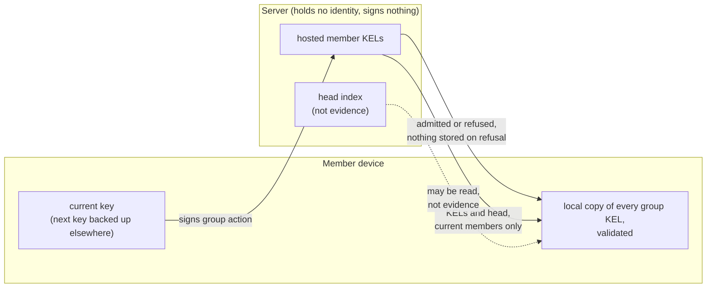
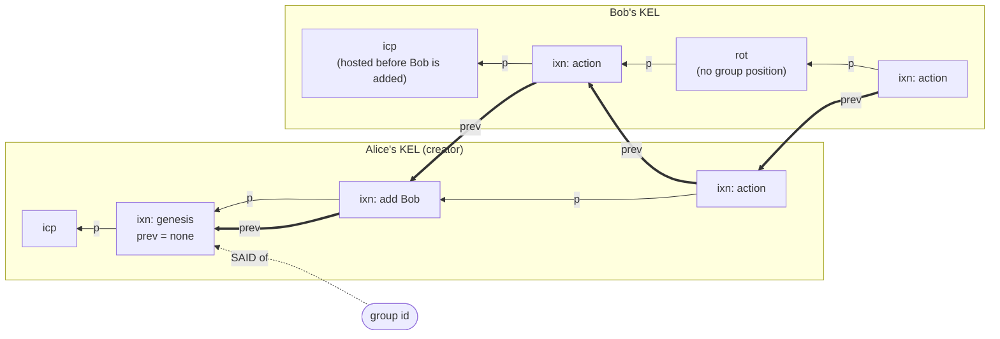
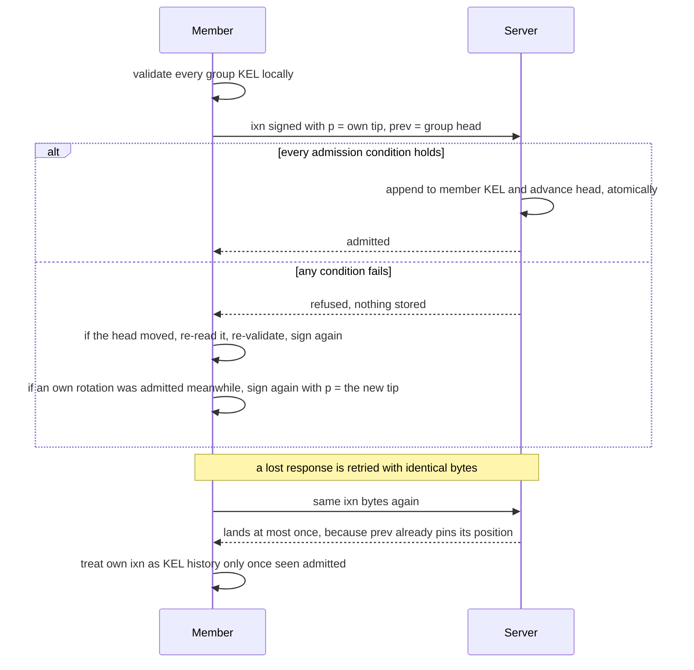
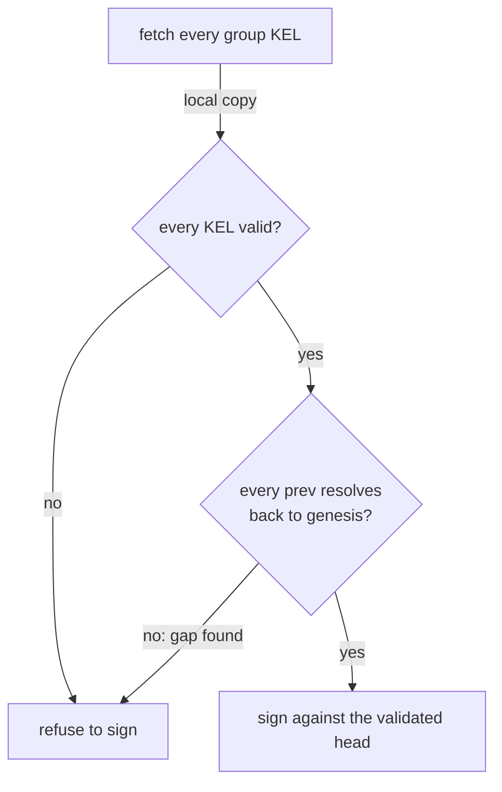
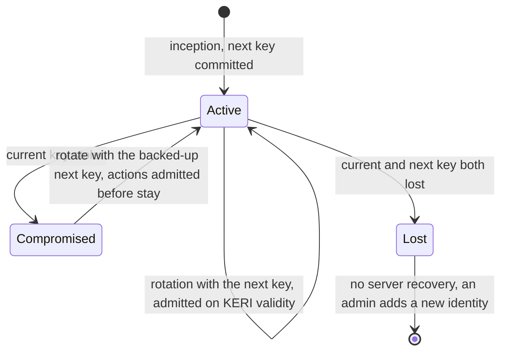
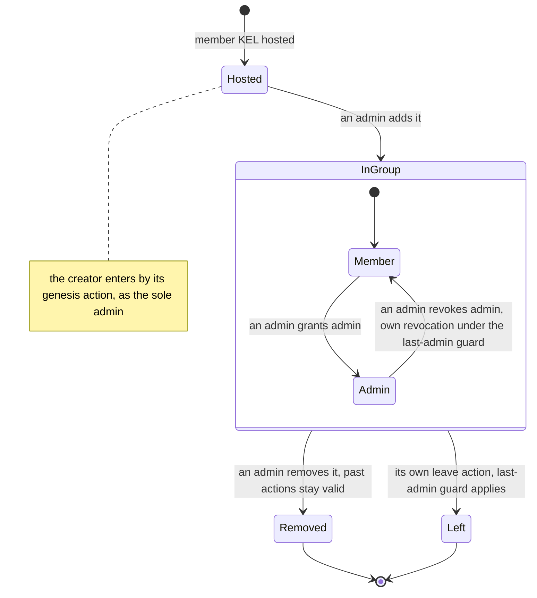
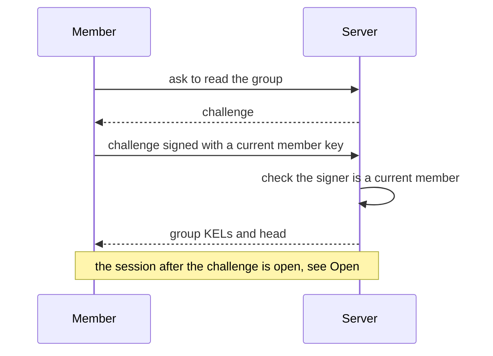

# Security design

This page is for anyone who belongs to a kelgroups group, builds a client or an
application on top of one, or runs the server that hosts it. It answers three
questions before any mechanism is named: what the server can and cannot do to
you, what exactly you sign when you act in a group, and what happens to your
place in the group when a key is stolen or lost.

> **Status.** This is the accepted design, settled on 2026-10-01. It is a
> design only: nothing on this page is implemented yet. Where other pages of
> this site describe a server identity, a bootstrap mode or admin voting, this
> page supersedes them.

## What you get

| You are | You want to | What you get | What you see when it is refused |
|---|---|---|---|
| A member | change the group | an action signed in your own KEL, against the group head you validated; it is final when you see it in the chain | nothing is stored; if the head moved, you re-read it and sign again |
| A member | trust what the server shows | forgery, reordering and a missing interior action are detectable from member signatures alone | a gap in the chain: you refuse to sign until it is resolved |
| A member whose current key is stolen | stop the thief | you rotate with your separately backed-up next key | the thief's actions admitted before your rotation stay in history |
| A member who lost both keys | come back | an admin adds your new identity | the old identity is gone; the server cannot recover it |
| An admin | manage who belongs | add and remove members, grant and revoke admin | the last admin cannot leave or drop its own admin unless another admin exists or it is the sole member |
| Someone running a host | run the server | store member KELs and admit actions one at a time | the server has no identity of its own and signs nothing |

## Trust

The server hosts every member's KEL and enforces single-line admission: it
orders group actions by admitting them one at a time. It has no KERI identity
and makes no signatures. The only evidence is what members sign.

What members assume, detect, and leave to the deployment:

| Category | What it covers |
|---|---|
| **Assumed, not detected** | The server may show different members different chains (a fork), or withhold the latest events. These are written trust assumptions. |
| **Detectable later without a format change** | Later detection of a fork or withholding, by members comparing head digests through any channel, must need no change to the signed format. |
| **Detected from member-signed evidence** | Forgery, reordering, and interior omission. |
| **Outside the protocol** | Transport security: see [Rulings after the design](#rulings-after-the-design). |

## The group action

A group action is an interaction event (`ixn`) in the member's own hosted KEL.
The member signs:

| Field | Value |
|---|---|
| group id | the self-addressing digest (SAID) of the group's genesis action |
| KERI `p` | the digest of the member's previous event in its own KEL |
| payload | opaque to the core, except the core membership actions |
| `prev` | the digest of the last admitted group action, from any member; none at genesis |

`p` and `prev` are two different links. `p` keeps a member's own KEL
hash-chained, as in any KERI KEL. `prev` pins the action to the whole group's
history, and that history crosses member KELs: the group chain is nothing but
the `prev` links inside admitted actions.

Thin arrows are KERI `p` links, each inside one KEL. Thick arrows are group
`prev` links, which cross from one member's KEL to another's. The genesis action
is the creator's first group action; its `prev` is none and the group id is its
self-addressing digest. Bob's rotation sits in his KEL between two of his
actions, but no `prev` points at it: rotations have no place in the group chain.

## Admission and retry

The server admits a group action if and only if:

- the signature is valid;
- `p` is the member's KEL tip;
- `prev` is the current group head;
- the signer is a current member, or the action is the genesis;
- the core membership rules hold.

Admission appends the action to the member's KEL and advances the group head
in one atomic step. Otherwise nothing is stored. A refused event is void, so
signing again at the same KEL sequence number is not duplicity.

- **Retry.** After a lost response the member resends the identical bytes. The
  action lands at most once.
- **Finality.** An action is final when it is visible in the chain.
- **Own history.** A member treats its own `ixn` as part of its KEL history only
  after it has seen that event admitted.

## Group chain and replay

The chain is the `prev` links inside admitted actions. No server-side structure
is evidence: a head index the server keeps is a convenience, never proof.

Each member holds and validates every group KEL locally before signing. Every
`prev` must resolve locally, link by link, back to the genesis action; if one
does not, the member has found a gap and refuses to sign.

## Identity

- **Rotations live only in member KELs.** The server admits a rotation on KERI
  validity alone; it has no position in the group chain. An action signed before
  a rotation and still in flight is stale, because its `p` is no longer the
  member's tip: it is refused, and the member signs it again.
- **Pre-rotation is mandatory.** Every inception and rotation commits to the
  digest of the next key.
- **Split custody.** The current key lives on the device; the next key is backed
  up separately.
- **Stolen current key.** The member rotates with the next key. Actions admitted
  before the rotation stay in history; there is no undo and no rollback.
- **Both keys lost.** The identity is lost. The member creates a new identity
  and an admin adds it to the group. The server has no recovery power.

## Membership

Membership is the only meaning the core gives to a payload; every other payload
is opaque to it and is given meaning by applications.

| Action | Who may issue it |
|---|---|
| add member | an admin |
| remove member | an admin |
| grant admin | an admin |
| revoke admin | an admin |
| leave | any member, for itself |

- The creator is the initial sole admin.
- The last admin cannot leave or drop its own admin unless another admin exists
  or it is the sole member.
- A new member's KEL is hosted before the action that adds it.
- A removed member's past actions stay valid; its later ones are refused.

## Rulings after the design

Two rulings were settled after the design above and have the same standing.

- **Reads are for current members only.** A group's KELs and head may be read
  only by its current members. A reader proves control of a current member key
  by signing a challenge the server issues.
- **TLS is required at deployment.** It sits outside the protocol and keeps
  reads and sessions private; integrity does not depend on it but rests on
  member signatures.

## Out of scope

- **Host replacement** happens out of band. Export is the KEL set every member
  already holds; nothing is server-only.
- **Multi-signature (k-of-n) actions.**
- **The Reactivegas extension** comes after the base foundation works.

## Decisions

| Decision | Chosen | Over | Why |
|---|---|---|---|
| What `prev` covers | the whole group head | a per-resource state | any two concurrent actions conflict; the one refused re-reads the head and signs again, so the group has one line of history |
| How `prev` refers to an action | a digest only | a member, KEL position and digest triple | every member holds the full validated KEL set, so the lookup is local |
| Forks and withheld events | written trust assumptions | a detection mechanism in the initial design | detection is left for later; comparing head digests must then need no change to the signed format |
| Where membership lives | in the core | left to applications | the server admits, and replay counts, only actions from current members |
| Moving to another host | out of band | a host-move action in the protocol | every member already holds the full KEL set; no host identity is in the signed bytes |

## Open

These are not decided and nothing on this page should be read as deciding them.

- **The read session after the challenge**: how a member stays authorised after
  signing the server's challenge, for example a cookie, and when that expires.
- **Fork and withholding detection**: how members compare head digests. Only the
  constraint is decided, that doing so needs no format change.
